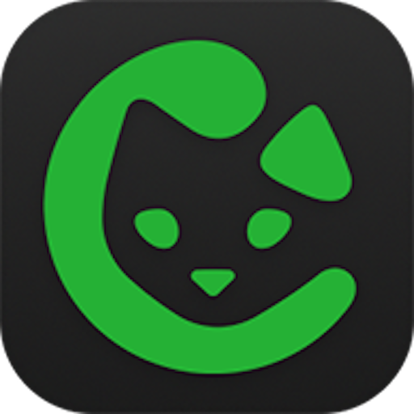

<p align="center">
  
</p>

# Bisq Mobile

## Releases

- **GitHub Releases (all APKs & changelogs):**
  https://github.com/bisq-network/bisq-mobile/releases

- **Bisq Easy Node for Android (full Bisq2 node):**

<p align="center">
  <!-- Bisq Easy Node (Android) -->
  <a href="https://play.google.com/store/apps/details?id=network.bisq.mobile.node">
    
  </a>
  <br/>
  <a href="https://play.google.com/store/apps/details?id=network.bisq.mobile.node"><strong>Bisq Easy on Google Play</strong></a>
</p>

- **Bisq Connect for Android (trusted node client):**
  - Learn how to use Bisq Connect: https://github.com/bisq-network/bisq-mobile/wiki/How-to-use-Bisq-Connect-(WIP)

<p align="center">
  <!-- Bisq Connect (Android) - enable link when Play listing is live -->
  <a href="https://play.google.com/store/apps/details?id=network.bisq.mobile.client">
    
  </a>
  <br/>
  <a href="https://play.google.com/store/apps/details?id=network.bisq.mobile.client"><strong>Bisq Connect on Google Play</strong></a>
</p>

- **Bisq Connect for iOS:**
  Planned for the end of this year (out-of-store distribution). See the wiki:
  https://github.com/bisq-network/bisq-mobile/wiki/How-to-use-Bisq-Connect-(WIP)


## Docs Index

1. [Bisq Mobile](#bisq-mobile)
   - [Goal](#goal)
   - [How to contribute](#how-to-contribute)
     - [Project dev requirements](#project-dev-requirements)
     - [Code Style & Linting](#code-style--linting)
   - [Getting started](#getting-started)
     - [Getting started for Android Node](#getting-started-for-android-node)
   - [Local Env Setup](#local-env-setup)
   - [UI](#ui)
     - [Designs](#designs)
     - [Navigation Implementation](#navigation-implementation)
   - [Configuring dev env: known issues](#configuring-dev-env-known-issues)

2. [Initial Project Structure](#initial-project-structure)

3. [App Architecture Design Choice](#app-architecture-design-choice)
   - [Dumb Views](#dumb-views)
   - [UI independently built](#ui-independently-built)
   - [Encourage Rich Domain well-test models](#encourage-rich-domain-well-test-models)
   - [Presenters guide the orchestra](#presenters-guide-the-orchestra)
   - [Repositories key for reactive UI](#repositories-key-for-reactive-ui)
   - [Services allow us to have different networking sources](#services-allow-us-to-have-different-networking-sources)
   - [What about Lifecycle and main view components](#what-about-lifecycle-and-main-view-components)
   - [When it’s acceptable to reuse a presenter for my view](#when-its-acceptable-to-reuse-a-presenter-for-my-view)

4. [Why KMP](#why-kmp)

## Goal

This project aims to make Bisq Network accesible in Mobile Platforms following the philosofy of Bisq2 - to make it
easier for both, experienced and newcomers, to trade Bitcoin in a decentralized way as well as defending Bisq motto: exchange, decentralized, private & secure.

To achieve this goal, we are building a total of 3 mobile apps that can be divided in 2 categories:

### Run a Bisq (Easy) Node on Mobile

 - **Bisq Easy Node for Android** (Gradle module `:apps:nodeApp`), an Android app that runs Bisq2 core and aims to bring a fully featured trading version of `Bisq2` (also referred to by its main protocol - `Bisq Easy`) to mobile for full privacy & security.

### Share a trusted Bisq Node

 - **Bisq Connect** (Gradle module `:apps:clientApp` for Android and the `iosClient` Xcode project for iOS), a thin Bisq client app that can be configured to connect to a trusted Bisq2 node (over Tor or clearnet) to cater for people willing to try Bisq from somebody they really trust (popularily described as "Uncle Jim") who is willing to share their Bisq node with them.

## How to contribute

We follow Bisq standard guidelines for contributions, fork + PR, etc. Please refer to [Contributor Checklist](https://bisq.wiki/Contributor_checklist)

We track work via GitHub issues at https://github.com/bisq-network/bisq-mobile/issues. Pick something that interests you or open a new issue for discussion.

For Jetpack Compose best practices in this project, see the [Compose guidelines](./docs/compose-guidelines/README.md).

### Code Style & Linting

This project uses **ktlint** with **Compose Rules** to maintain consistent code style across the
codebase.

#### Quick Commands

```bash
# Check code style
./gradlew ktlintCheck

# Auto-fix style violations
./gradlew ktlintFormat
```

#### Git Hooks

Git hooks are automatically installed when you sync the project. They will:

- **Pre-commit**: Check ktlint on staged files only (with auto-fix prompt)
- **Pre-push**: Run full ktlint check + unit tests

To bypass hooks temporarily (not recommended):

```bash
git commit --no-verify
git push --no-verify
```

#### CI/CD

All pull requests automatically run ktlint checks in CI. Make sure your code passes locally before
pushing:

```bash
./gradlew ktlintCheck test
```

#### Configuration

- **`.editorconfig`**: Main ktlint configuration with Compose-specific rules
- **`build.gradle.kts`**: ktlint plugin setup (version 1.7.1)
- **Compose Rules**: Enabled for Compose best practices enforcement

For now follow along to learn how to run this project.
If you are a mobile enthusiast and feel driven by Bisq goals, please reach out!

### Project dev requirements

 - Java: 21.0.6.fx-zulu JDK (sdkman env file is avail in project root)
 - Ruby: v3+ (for iOS Cocoapods 1.15+)
 - IDE: We recommend using Android Studio with the Kotlin Multiplatform Mobile (KMP) plugin. For iOS testing you will need XCode installed and updated.

### Getting started

 1. Get [sdkman](https://sdkman.io/) installed since the project uses JDK 
 2. Open Android Studio with the Kotlin Multiplatform Mobile plugin installed and open the project root folder.
 3. Wait for the Gradle sync to complete and download the dependencies. This will let you know what's missing in your machine to run the project. 
    1. If you are on a MacOS computer building the iOS app you can go ahead and run `setup_ios.sh` script and build the project and run it in your device or emulator.
    2. For Android it can run on any machine, just run the preconfigured run configurations `clientApp` and/or `nodeApp` in Android Studio

Alternatively, you could run `./gradlew clean build` first from terminal and then open with Android Studio.

### `Getting started for Android Node`

For the `androidNode` module to build, you need the Bisq2 dependencies. There are two ways to get them:

#### Option 1: For developers (using local Maven repository)

1. Download [Bisq2](https://github.com/bisq-network/bisq2) if you don't have it already
2. Bisq Android Node uses Bisq2 core code by design, this dependency will always be against a bisq2 branch OFF A STABLE RELEASE + commits of current bisq-mobile development.
Check the current codebase bisq-core dependency version in the [toml file](https://github.com/bisq-network/bisq-mobile/blob/main/gradle/libs.versions.toml), at the top of the file `bisq-core` property will have the version (e.g. "2.1.7"). Now go ahead and checkout the bisq2 dev branch for bisq-mobile which follows the pattern `for-mobile-based-on-[VERSION]`(E.g. if the bisq-core-version="2.1.7" then checkout [for-mobile-based-on-2.1.7](https://github.com/bisq-network/bisq2/tree/for-mobile-based-on-2.1.7) - `git checkout for-mobile-based-on-2.1.7`). You can double check if that branch is from the right release line comparing the initial commit of the branch with the tomml `bisq-core-commit` value :)
4. Follow Bisq2 root `README.md` steps to build the project.
5. Run `./gradlew publishAll` // this will install all the jars you need in your local m2 repo


**NOTE #1** For bisq-mobile release the `bisq-core-commit` should point to the exact commit the apps were design to work with

**NOTE #2** if you have troubles publishing the jars try `./gradlew cleanAll buildAll publishAll publishAll -- info` it's known to always update properly

#### Option 2: For CI (using remote Maven repository)

The CI environment automatically uses our remote Maven repository to get the Bisq2 dependencies. No additional setup is required.

Done! Alternatively if you are interested only in contributing for the `xClients` you can just build them individually instead of building the whole project.

### Local Env Setup

**Node**

You just need to run a local bisq seed node from the bisq2 project. By default port 8000 is used

**Clients**

You need to run the seed node as explained above + the http-api module with the following VM parameters

```
 -Dapplication.appName=bisq2_restApi_clear
 -Dapplication.network.supportedTransportTypes.2=CLEAR
 -Dapplication.devMode=true
 -Dapplication.devModeReputationScore=50000
```

Default networking setup for the WebSocket (WS) connection can be found in `gradle.properties` file. You can change there for locally building pointing at the ip you are interested in.

### UI

**Designs**

androidNode + xClient screens are designed in Figma.
Yet to differentiate between which screens goes into which.

Figma link: https://www.figma.com/design/IPnuicxGKIZXq28gybxOgp/Xchange?node-id=7-759&t=LV9Gx9XgJRvXu5YQ-1

Though the figma design captures most of the functionality, it's an evolving document. It will be updated with new screens, flow updates, based on discussions happening in GH issues / matrix.

**Navigation Implementation**

Please refer to [this README](shared/presentation/src/commonMain/kotlin/network/bisq/mobile/presentation/ui/navigation/README.md)

### Configuring dev env: known issues

 - Some Apple M chips have trouble with cocoapods, follow [this guide](https://stackoverflow.com/questions/64901180/how-to-run-cocoapods-on-apple-silicon-m1/66556339#66556339) to fix it
 - On MacOS: non-homebrew versions of Ruby will cause problems
 - On MacOS: If Gradle sync fails with "Gradle not found" error, you may need to install gradle with `homebrew` and then run `gradle wrapper` on the root. Then reopen Android Studio and try syncing again.

### Initial Project Structure


Though this can evolve, this is the initial structure of this KMP project:
 - **shared:domain**: Domain module has models (KOJOs) and components that provide them.
 - **shared:presentation**: Contains UI shared code using Kotlin MultiPlatform Compose Implementation forr all the apps, its Presenter's behaviour contracts (interfaces) and default presenter implementations that connects UI with domain.
 - **iosClient**: Xcode project that generates the thin iOS client from sharedUI
 - **androidClient**: (now found in `apps:clientApp`) Kotlin Compose Android thin app. This app as well should have most if not all of the code shared with the iosClient.
 - **androidNode**: (now found in `apps:nodeApp`) Bisq2 Implementation in Android, will contain the dependencies to Java 17 Bisq2 core jars.

## App Architecture Design Choice


This project uses the [MVP](https://en.wikipedia.org/wiki/Model%E2%80%93view%E2%80%93presenter) (Model-View-Presenter) Design Pattern with small variations (__introducing Repositories & we allow reusal of presenters under specific conditions__) in the following way:

 - **Dumb Views**: Each View will define it's desired presenter behaviour. For example, for the `AppView` it would define the `AppPresenter` interface. This includes which data its interested in observing and the commands it needs to trigger from user interactions.
 - **UI indepdently built**The view will react to changes in the presenter observed data, and call the methods it needs to inform the presenter about user actions. In this way __each view can be created idependently without strictly needing anything else__
 - **Encourage Rich Domain well-test models** Same goes for the Models, they can be built (and unit tested) without needing anything else, simple POKOs (Plain Old Kotlin Objects - meaning no external deps). Ideally business logic should go here and the result of executing a business model logic should be put back into the repository for all observers to know.
 - **Presenters guide the orchestra** When you want to bring interaction to life, create a presenter (or reuse one if the view is small enough) and implement the interface you defined when doing the view (`AppPresenter` interface for example). That presenter will generally modify/observe the models through a repository and/or a service. The most important thing is that mutable/unmutable observability should happen here connecting those fields that the view needs with the real data as appropiate case-by-case.
 - **Repositories key for reactive UI** Now for the presenter to connect to the domain models we use repositories which is basically a storage of data (that abstracts where that data is stored in). The repositories also expose the data in an observable way, so the presenter can satisfy the requested data from the view from the data of the domain model in the ways it see fit. Sometimes it would just be a pathrough. The resposities could also have caching strategy, and persistance. For most of the use cases so far we don't see a strong need for persistance in most of them (with the exception of settings-related repositories) - more on this soon
 - **Services allow us to have different networking sources** we are developing 3 apps divided in 2 groups: `node` and `client`. Each group has a very distinct networking setup. We need each type of app build to have only the networking it needs. The proposed separation of concerns not only allows a clean architecture but also allows faster development focus on each complexity separately. We found that for the `androidNode` it makes sense to handle all the domain stuff directly using domain models in the services without connecting to a repository since the bisq-core jars manage all the persistance. You have the option to decide how to connect this in your presenter.


### What about Lifecycle and main view components

As per original specs `single-activity` pattern (or `single-viewcontroller` in iOS) is sufficient for this project. Which means, unless we find a specific use case for it, we'll stick to a single Activity/ViewController for the whole lifecycle of the app.

The app's architecture `BasePresenter` allows a tree like behaviour where a presenter can be a root with dependent child presenters.

We leverage this by having:

 - A `MainPresenter` that acts as root in each and all of the apps
 - The rest of the presenters require the main presenter as construction parameter to be notified about lifecycle events.


### When its acceptable to reuse a presenter for my view?

It's ok to reuse an existing presenter for your view if:

 - Your view is a very small part of a bigger view that renders together (commonly called `Screen`) and you can't foresee reusal for it
 - Your view is a very small part of a bigger view and even if its reused the presenter required implementation is minimal

To reuse an existing presenter you would have to make it extend your view defined presenter interface and do the right `Koin bind` on its Koin repository definition.

Then you can inject it in the `@Composable` function using `koinInject()`.

## Why KMP

- Native Performance
- Allows us to focus on the "easiest" platform first for the Node (Because of Apple restrictions on Tor and networking in general). Althought unexpected, if situation changes in the future we could cater for an iOS Node.
- Flexibility without the security/privacy concerns of its competitors
- (Node)JVM language allows us to port much of the optimised Bisq code already existing in the Desktop apps
- Kotlin Compose UI allows us to share UI code easily across the 3 apps.

If you are interested in seeing the POCs related to the R&D before this project kicked-off please refer to [this branch](https://github.com/bisq-network/bisq-mobile/tree/pocs)

This project is tested with BrowserStack
